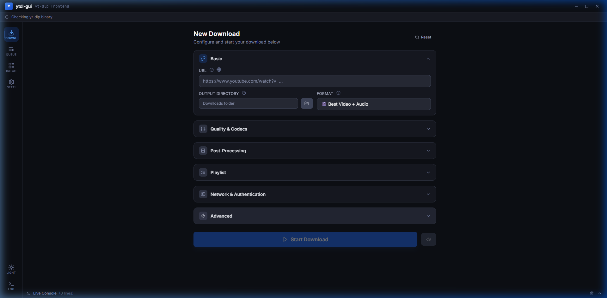
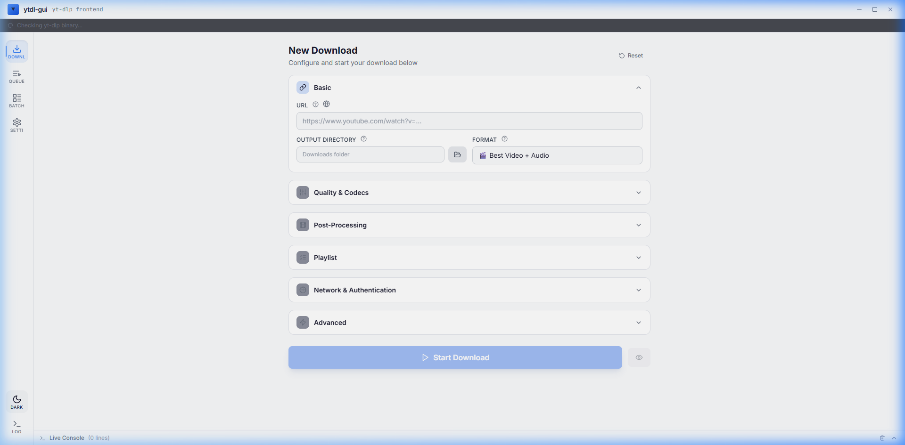

<p align="center">
  
</p>

<h1 align="center">ytdlp-gui-advanced</h1>

<p align="center">
  A premium, cross-platform GUI for <a href="https://github.com/yt-dlp/yt-dlp">yt-dlp</a> — download videos and audio from <strong>1800+ sites</strong>.
</p>

<p align="center">
  
  
  
  
</p>

---

<p align="center">
  
  
</p>
<p align="center"><sub>Dark mode (left) &nbsp;·&nbsp; Light mode (right)</sub></p>

---

## ✨ Features

| Category | Details |
|---|---|
| 🎬 **Full yt-dlp control** | Formats, codecs (H.264/H.265/VP9/AV1), resolution up to 8K, HDR, SponsorBlock, subtitles, chapters |
| 📥 **Real-time download queue** | Live progress bars, speed (MB/s), ETA, cancel/retry |
| 📦 **Batch & channel download** | Paste multiple URLs or download entire channels/playlists with date filters, limits, and archive tracking |
| 🔄 **Auto-update binary** | Checks GitHub API and downloads the correct yt-dlp binary for your OS |
| 🖥️ **Live console** | Expandable raw terminal output for advanced users |
| 🌐 **Network & auth** | Proxy, cookies, rate limiting, concurrent fragments |
| 🌍 **10 languages** | 🇺🇸 EN · 🇧🇷 PT · 🇪🇸 ES · 🇫🇷 FR · 🇩🇪 DE · 🇮🇹 IT · 🇨🇳 ZH · 🇯🇵 JA · 🇷🇺 RU · 🇸🇦 AR |
| ☀️🌙 **Dark & light themes** | Toggle between dark and light mode from the sidebar |
| ❓ **In-app help** | Every field has a popover explaining what it does, plus a searchable supported-sites list |
| 🎉 **Guided onboarding** | First-run welcome screen with feature overview, dependency setup, and language picker |

---

## 📥 Download

Grab the latest release for your platform:

| Platform | File | Description |
|---|---|---|
| 🪟 Windows | `ytdl-gui-*-x64.exe` | Portable — no installation required |
| 🐧 Linux | `ytdl-gui-*.AppImage` | AppImage — run directly |
| 🍎 macOS (Intel) | `ytdl-gui-*.dmg` | DMG — drag to Applications |
| 🍎 macOS (Apple Silicon) | `ytdl-gui-*-arm64.dmg` | DMG — native ARM build |

👉 **[Latest Release](https://github.com/pe-dro/ytdlp-gui-advanced/releases/latest)**

> **Note:** Windows and macOS builds are unsigned. You may need to allow the app in your security settings.

---

## 🚀 Getting Started

### First run

On first launch, a **welcome screen** guides you through:

1. **Features overview** — what the app can do
2. **Dependency setup** — automatically downloads `yt-dlp` (ffmpeg is bundled)
3. **Language selection** — pick from 10 languages

After setup, you're ready to paste a URL and download.

### Default directories

The app automatically creates:

- `binaries/` — stores the yt-dlp executable
- `~/Downloads/ytdl-gui/` — default output folder for downloaded files

---

## 🛠️ Development

```bash
# Install dependencies
npm install

# Start in dev mode (Vite + Electron with hot reload)
npm run dev
```

### Build for production

```bash
# All desktop platforms
npm run dist

# Windows portable (.exe)
npm run dist:win

# Linux AppImage
npm run dist:linux

# macOS DMG
npm run dist:mac
```

Outputs go to the `out/` directory.

---

## 🏗️ Project Structure

```
ytdlp-gui-advanced/
├── electron/
│   ├── main.js              # Main process: window, IPC, binary management, yt-dlp spawn
│   └── preload.js           # Context bridge (secure IPC)
├── src/
│   ├── context/
│   │   ├── AppContext.jsx    # Global state (reducer + IPC listeners)
│   │   └── ThemeContext.jsx  # Dark/light theme management
│   ├── components/
│   │   ├── TitleBar.jsx      # Custom title bar with window controls
│   │   ├── Sidebar.jsx       # Navigation + theme toggle
│   │   ├── BinaryBanner.jsx  # yt-dlp/ffmpeg status bar
│   │   ├── Console.jsx       # Live terminal output
│   │   ├── WelcomeScreen.jsx # First-run onboarding (3 steps)
│   │   ├── Popover.jsx       # Reusable popover component
│   │   ├── SupportedSites.jsx# Searchable sites popover (30+)
│   │   ├── Section.jsx       # Collapsible accordion section
│   │   └── FormParts.jsx     # Input, Toggle, Select, etc.
│   ├── pages/
│   │   ├── DownloaderPage.jsx# Main download form with field-level help
│   │   ├── QueuePage.jsx     # Download queue with live progress
│   │   ├── BatchPage.jsx     # Bulk URLs + channel/playlist download
│   │   └── SettingsPage.jsx  # Binary, theme, language, about
│   ├── i18n/
│   │   ├── index.jsx         # Translation engine (dot-notation, interpolation)
│   │   └── locales/          # 10 language files (en, pt, es, fr, de, it, zh, ja, ru, ar)
│   ├── App.jsx               # Root layout + providers
│   ├── main.jsx              # React entry point
│   └── index.css             # Design system + light theme overrides
├── .github/workflows/
│   ├── release.yml           # CI: build Win/Linux/macOS + GitHub Release
│   └── ci.yml                # CI: lint & build check on push/PR
├── vite.config.js
├── tailwind.config.js
└── package.json
```

---

## 🔧 Tech Stack

| Layer | Technology |
|---|---|
| Desktop runtime | Electron 36 |
| UI framework | React 19 |
| Styling | Tailwind CSS 3 |
| Build tool | Vite 6 |
| Download engine | yt-dlp (auto-managed) |
| Audio/video processing | ffmpeg-static (bundled) |
| CI/CD | GitHub Actions |
| Packaging | electron-builder |

---

## 🌐 Supported Sites

yt-dlp supports **1800+ websites** including:

YouTube · Vimeo · Twitter/X · Instagram · TikTok · Facebook · Reddit · Twitch · SoundCloud · Spotify · Dailymotion · Bilibili · Rumble · Crunchyroll · Bandcamp · Kick · Odysee · Niconico · BBC iPlayer · and many more.

👉 [Full list of supported sites](https://github.com/yt-dlp/yt-dlp/blob/master/supportedsites.md)

---

## 📋 CI/CD Pipeline

Every tagged release (`v*`) triggers automated builds:

```
git tag v1.2.0 && git push origin v1.2.0
```

```
tag pushed → 3 parallel workflows
├── 🪟 windows-latest → portable .exe (x64)
├── 🐧 ubuntu-latest  → AppImage (x64)
└── 🍎 macos-latest   → DMG (x64 + arm64)
         ↓
   🚀 GitHub Release with all binaries
```

---

## 📜 License

MIT © [pe-dro](https://github.com/pe-dro)
